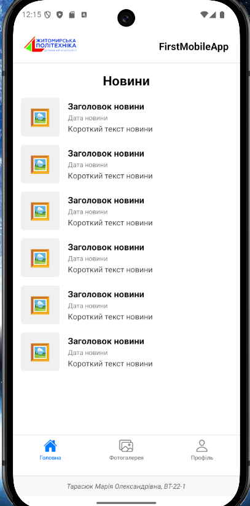
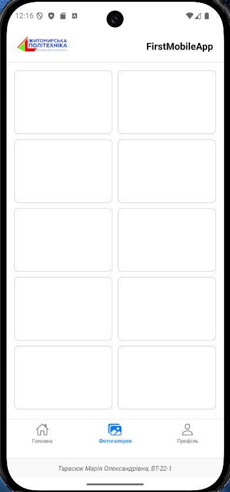
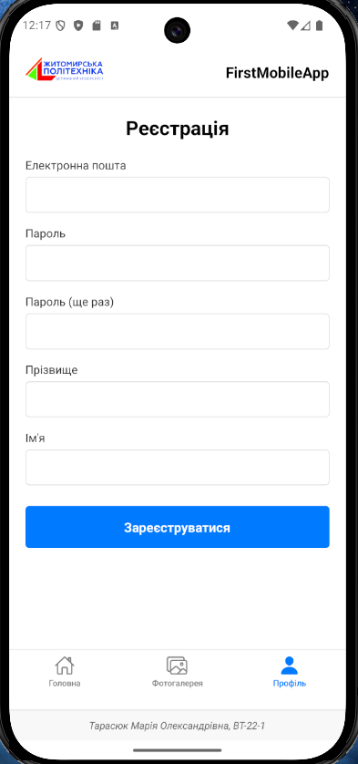

# Лабораторна робота №1

## Опис проєкту

Це простий мобільний застосунок, створений за допомогою **React Native**
та **Expo**. Додаток демонструє використання базових компонентів,
навігації та структури проєкту.

## Функціонал

-   Екран новин (FlatList)
-   Фотогалерея (Grid)
-   Екран профілю (форма реєстрації)
-   Нижня навігація (Tab Navigator)

## Використані технології

-   React Native
-   Expo
-   React Navigation
-   Expo Vector Icons


## Інструкція запуску

1. **Встановити Node.js** (якщо ще не встановлено).
2. **Встановити Expo CLI** (глобально):
```
   npm install -g expo-cli
```
3. **Встановити залежності:**
```
   npm install
```
4. **Запустити проєкт:**
```
   npx expo start
```

## Способи запуску

### 1. Expo Go (рекомендовано)

-   Скануєш QR-код
-   Швидкий запуск на телефоні

### 2. Android Emulator

-   Через Android Studio
-   Підходить для тестування без телефону

### 3. iOS Simulator (Mac only)

-   Через Xcode

## Відмінності

-   Expo Go --- найшвидший старт
-   Емулятори --- більше контролю для тестування
-   iOS Simulator --- тільки на macOS

## Скріншоти

### Новини



### Галерея



### Профіль



## Автор

Тарасюк Марія Олександрівна, ВТ-22-1
