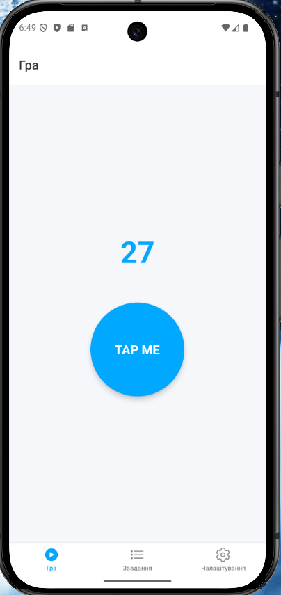
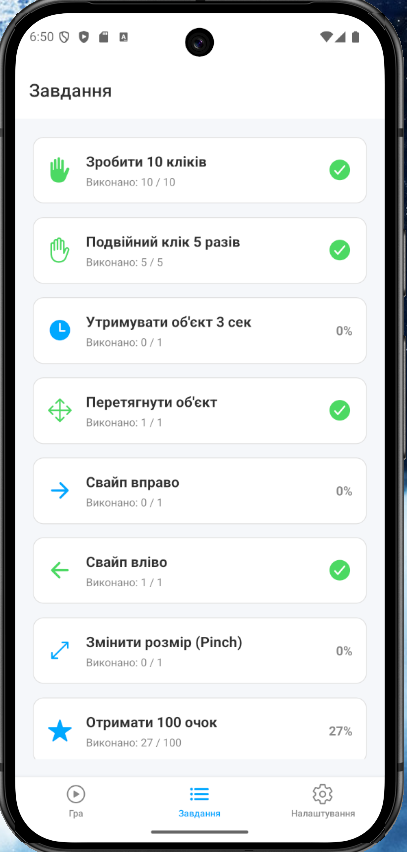
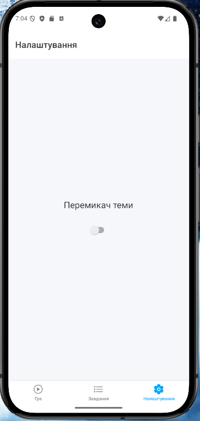
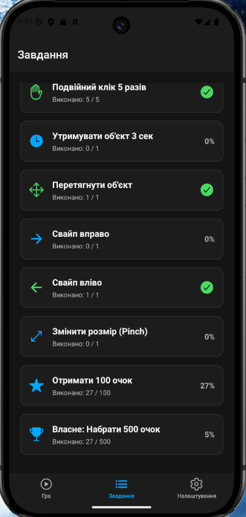

# Лабораторна робота №3

## Тема
Використання кастомних жестів у React Native та стилізація інтерфейсу.

## Мета
- Робота з жестами користувача
- Реалізація взаємодії через різні типи жестів
- Використання Styled Components
- Підтримка світлої та темної теми

---

## Інструкція запуску

1. Встановити Node.js  
2. Встановити залежності:
```bash
npm install
````

3. Запустити проєкт:

```bash
npx expo start
```

4. Відкрити застосунок:

* через Expo Go (скан QR-коду)
* через Android Emulator
* через iOS Simulator

---

## Реалізований функціонал

### Головний екран (гра)

* Лічильник очок
* Інтерактивний об'єкт
* Реалізовані жести:

  * **Tap** → +1 очко
  * **Double Tap** → +2 очки
  * **Long Press** → +5 очок
  * **Pan** → перетягування об'єкта
  * **Fling (свайп)** → випадкова кількість очок
  * **Pinch** → масштабування + бонус

---

### Екран завдань

* Відображення списку завдань
* Прогрес виконання
* Відсоток виконання
* Візуальний статус (виконано / не виконано)

Реалізовані завдання:

* 10 кліків
* 5 подвійних кліків
* утримання 3 секунди
* перетягування
* свайп вправо / вліво
* масштабування
* набір 100 очок
* власне завдання (500 очок)

---

### Екран налаштувань

* Перемикач теми (Light / Dark)

---

### Стилізація

* Styled Components
* Темізація:

  * світла тема
  * темна тема
* Динамічні кольори інтерфейсу

---

### Архітектура

* Context API (GameContext)
* Глобальний стан:

  * score (очки)
  * stats (статистика жестів)

---

## Скріншоти

### Екран гри



### Завдання



### Перемикач



### Темний режим



---

## Висновки

У ході виконання лабораторної роботи було:

* освоєно роботу з Gesture Handler;
* реалізовано різні типи жестів користувача;
* застосовано бібліотеку Reanimated;
* використано Styled Components для стилізації;
* реалізовано підтримку світлої та темної теми;
* організовано керування станом через Context API.

Отримані знання дозволяють створювати інтерактивні, сучасні та продуктивні мобільні застосунки з розширеною взаємодією користувача.

---

## Автор

Тарасюк Марія Олександрівна, ВТ-22-1

