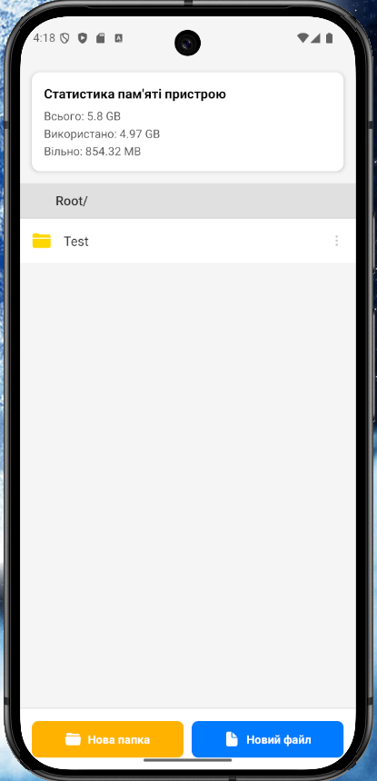
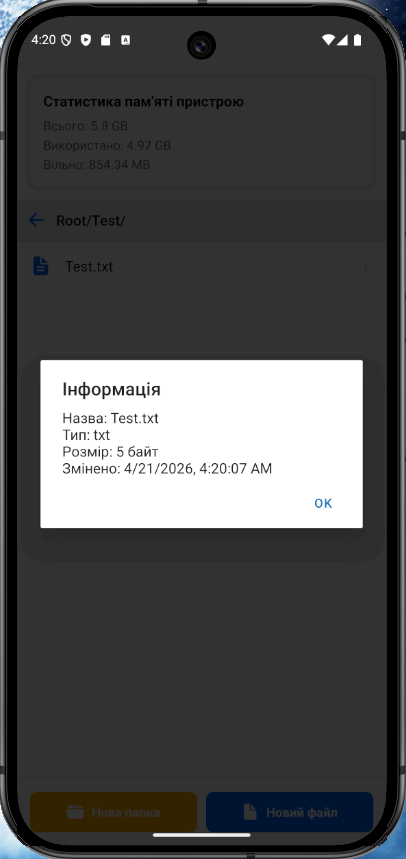

# Лабораторна робота №4

## Тема

Робота з файловою системою в React Native з використанням
expo-file-system.

## Мета

- Ознайомлення з файловою системою
- Робота з файлами та папками
- Навігація між директоріями
- Отримання статистики пам'яті

---

## Інструкція запуску

1. Встановити Node.js
2. Встановити залежності:

```bash
npm install
```

3. Запустити проєкт:

```bash
npx expo start
```

4. Відкрити застосунок:

- через Expo Go (скан QR-коду)
- через Android Emulator
- через iOS Simulator

---

## Реалізований функціонал

### Навігація

- Відображення поточного шляху (breadcrumb)
- Перехід у вкладені папки
- Кнопка "назад"

---

### Створення

- Створення папок
- Створення .txt файлів
- Початковий вміст файлу

---

### Зчитування

- Відкриття .txt файлів
- Перегляд вмісту

---

### Редагування

- Редагування тексту
- Збереження змін

---

### Видалення

- Видалення файлів і папок
- Підтвердження перед видаленням

---

### Інформація про файл

- Назва
- Тип
- Розмір
- Дата зміни

---

### Статистика памʼяті

- Загальний обсяг
- Використано
- Вільно

---

## Скріншоти

### Головний екран



### Створення файлу


### Інформація про файл



### Редагування файлу


### Видалення файлу


---

## Висновки

У ході виконання роботи:

- освоєно бібліотеку expo-file-system;
  -реалізовано CRUD операції над файлами;
- реалізовано навігацію по
  файловій системі;
- отримано статистику пам'яті пристрою;
- створено файловий менеджер.

---

## Автор

Тарасюк Марія Олександрівна, ВТ-22-1
